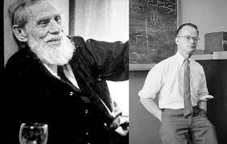
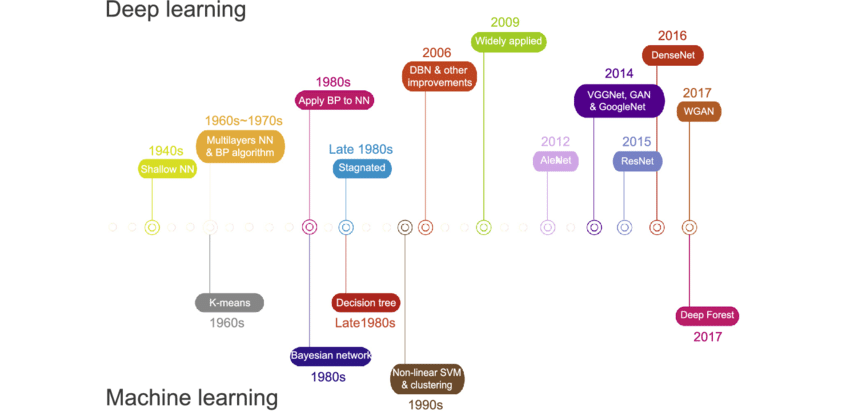

# Lesson 1: Foundational Concept of Deep Learning

### **Instructional Material**

Welcome learners! This guide covers foundational concepts, including the background, history, and evolution of deep learning, and clarifies its distinctions from AI and ML. We delve into the mechanics of deep learning, explaining neural networks, the backpropagation method, types of deep neural networks, and their applications. Additionally, we highlight real-world use cases and current trends in deep learning, and focus on specific algorithms such as Convolutional Neural Networks (CNNs) and strategies for improving both Deep Neural Networks (DNNs) and CNNs. Whether you're a beginner or an experienced practitioner, this material provides valuable insights and practical knowledge to harness the power of deep learning.

### **I.Foundational Concept of Deep Learning**

Before diving into the exciting developments in deep learning, let's take a moment to review what we've learned so far. First, we'll discuss the concept of data analytics. **Data analytics** involves the systematic examination of raw data to draw meaningful conclusions and insights. Many techniques and processes in data analytics have been automated using algorithms and mechanical procedures, making it easier for humans to interpret large datasets. Businesses and other organizations leverage data analytics to enhance their performance and boost profits by employing various software tools to collect and analyze raw data.

The 4 Types of Data Analytics (Matteson A., 2017)

Data analytics is the field that includes various methods of data exploration. Any kind of information can undergo data analytics to extract insights that can drive improvements. These techniques can uncover trends and metrics that might otherwise be obscured within large datasets. Such insights can then be utilized to optimize processes, enhancing the overall efficiency of a business or system. There are four types of data analytics, each are in their own respective level of **value** and **complexity**.

**Descriptive Analytics**

Descriptive analytics focuses on summarizing historical data to understand what has happened over a given period. It uses data aggregation and data mining techniques to provide insights into past performance and trends. By creating reports, dashboards, and scorecards, descriptive analytics helps organizations understand their current status and how they got there. This form of analytics is foundational, as it provides the context and baseline information necessary for more advanced types of analysis.

**Diagnostic Analytics**

Diagnostic analytics goes a step further by examining data to determine the causes of past outcomes. It delves into the details of descriptive analytics to uncover why certain events occurred. Techniques such as drill-down, data discovery, data mining, and correlations are used to identify patterns and relationships. This type of analytics helps organizations understand the underlying reasons behind trends and anomalies, providing a deeper insight into the factors influencing their performance.

**Predictive Analytics**

Predictive analytics uses statistical models and machine learning algorithms to analyze historical data and make forecasts about future events. By identifying patterns and trends from past data, predictive analytics can estimate the likelihood of future outcomes. This type of analytics is crucial for decision-making, as it allows organizations to anticipate potential challenges and opportunities, helping them to plan and strategize more effectively.

**Prescriptive Analytics**

Prescriptive analytics goes beyond predicting future outcomes by recommending actions to achieve desired results. It uses optimization and simulation algorithms to suggest the best course of action based on the predicted data. Prescriptive analytics takes into account various constraints and objectives, providing specific guidance on how to address potential issues or capitalize on opportunities. This advanced form of analytics supports decision-making by suggesting actions that can help achieve business goals and improve overall performance.

Understanding the four types of analytics is crucial for mastering artificial intelligence (AI). **Descriptive analytics** lays the groundwork by summarizing historical data, providing insights into past trends essential for building predictive models in AI. **Diagnostic analytics** goes deeper, uncovering the reasons behind trends, which is fundamental in training AI algorithms to recognize patterns and anomalies effectively. **Predictive analytics** plays a pivotal role by forecasting future outcomes based on historical data, a capability vital for AI systems to make informed decisions and projections. Finally, **prescriptive analytics** not only predicts future scenarios but also prescribes optimal actions to achieve desired outcomes, guiding AI systems in making proactive and strategic decisions. Together, these analytics types form the backbone of AI learning, equipping developers and researchers with the tools to enhance AI capabilities, optimize performance, and drive innovation across various domains.

#### **Example Scenario:**

Dr. Jake is a medical doctor and the CEO of Astro JR, a giant pharmaceutical company in the Philippines. To support the production and use of AstroJR's COVID19 vaccine, this company has implemented a number of business intelligence and data analytics tools. Your task is to provide the appropriate and necessary analytical questions Dr. Jake must ask his analytics team in order to provide better deployment and production of COVID19 vaccines around the world using descriptive, predictive, and prescriptive analytics.

1.  **Descriptive:** How many infected cases since last week?
2.  **Diagnostic:** What factor affects the demand of AstroJR's COVID19 vaccine?
3.  **Predictive:** How many deaths next week?
4.  **Prescriptive:** If the number of cases will increase next week, how many hospital staff should be here to adequately treat the influx of patients?

To address the key questions identified by the analytics team, historical data on deaths will be crucial. By analyzing this time-series data, the team can leverage statistical modeling techniques to uncover patterns and trends that will enable them to generate accurate forecasts. The inclusion of a time variable in the inquiry makes the use of these statistical models essential, as they are specifically designed to handle and extract insights from data with a temporal component. This predictive modeling process will also introduce the team to the potential applications of **Artificial Intelligence (AI)** in this domain.

### Laboratory Task 1

**Instruction:** From the example scenario above, create additional two inquiries for each type of data analytics.

1.  **Descriptive:**
2.  **Diagnostic:**
3.  **Predictive:**
4.  **Prescriptive:**

### **Artificial Intelligence vs. Machine Learning vs. Deep Learning**

Having discussed AI previously, let's now delve into distinguishing between these three areas within predictive analytics.

A systematic review of artificial intelligence techniques for collaborative learning over the past two decades (Tan et al., 2022)

(https://www.sciencedirect.com/science/article/pii/S2666920X22000522)

**Artificial Intelligence**

is the broadest concept and encompasses the idea of creating machines or systems that can perform tasks that typically require human intelligence. This includes **problem-solving**, **understanding natural language**, **recognizing patterns**, and **making decisions**. AI can be achieved through various techniques, including ML and DL.

**Machine Learning**

is a subset of AI that focuses on the development of **algorithms** and **statistical models** that enable computers to learn from and make predictions or decisions based on data. ML doesn't require explicit programming for every task but relies on the algorithm's ability to improve its performance as it encounters more data.

**Deep Learning**

is a subfield of ML that deals specifically with **artificial neural networks**, which are composed of multiple layers of interconnected nodes (neurons). DL excels at handling unstructured data, such as images, audio, and text, and has been particularly successful in tasks like image recognition, natural language processing, and speech recognition.

Artificial Intelligence encompasses creating systems for problem-solving, natural language understanding, pattern recognition, and decision-making. Machine Learning develops algorithms for learning from data to make predictions or decisions without explicit programming. Deep Learning, within Machine Learning, uses neural networks for processing unstructured data like images, audio, and text, achieving remarkable success in tasks such as image recognition and natural language processing.

### **Comparison between Deep Learning and Machine Learning**

| Machine Learning | Deep Learning |
|-----------------|---------------|
| Requires a small amount of training data. | Requires a large amount of training data. |
| Programmer has to manually identify the features that the system will use. | Machine automatically identifies the important features based on the training data. |
| In most cases, focus is on solving a particular problem. | In most cases, focus is on identifying patterns from the training dataset. |
| Problem is divided into parts and solved individually and then combined. | The entire processing takes place in an end-to-end manner. |
| The output result is easy to understand, since clear rules are provided. | The reasoning may be difficult to understand, since the system takes decision based on its own logic. |
| Training usually costs lesser time. | Training usually costs more time. |
| Works in low processing power. | Needs high processing power. |
| Machines can take decision on their own based on past data. | Machines take decisions with the help of artificial neural networks. |

### **Historical Background of Deep Learning**

The Revolutionary Rise of Deep Learning AI (Rashmi A., 2024)

(https://medium.com/@picturesqueen01/the-revolutionary-rise-of-deep-learning-ai-0868e3f18290)

Warren Sturgis McCulloch (1898 – 1969) neurophysiologist and logician and mathematician Walter Pitts (1923 – 1969) are best known for their influential paper in computing and neural network computing A Logical Calculus of Ideas Immanent in Nervous Activity (1943). They were the first to create a mathematical model of a neuron, inspired by the concept of a biological neuron. This led to the development of ever more sophisticated neuron and neural network models and their astounding success in artificial intelligence.

An Integrated Machine Learning and Finite Element Analysis Framework, Applied to Composite Substructures including Damage (Gulikers T., 2017)

](https://www.semanticscholar.org/paper/An-Integrated-Machine-Learning-and-Finite-Element-Gulikers/89c969111800be0cf3187be86c8e64e282b813c7)

Neural networks are computational models inspired by the intricate structure of the human brain. They consist of layers of interconnected artificial neurons that process and transform information. Just as the neurons in the brain communicate through synapses, these artificial neurons pass signals and weights between them, allowing neural networks to learn and make complex decisions. This bio-inspired architecture enables neural networks to excel in tasks such as image recognition, natural language processing, and pattern recognition, making them a foundational technology in the field of artificial intelligence.

### **Historical Background of Deep Learning**

Deep Learning and Its Applications in Biomedicine (Cao et al., 2018)

(https://www.researchgate.net/publication/323612444_Deep_Learning_and_Its_Applications_in_Biomedicine)

| Time | Development |
|------|-------------|
| 1940s | Shallow Neural Networks, also known as feedforward neural networks or single-layer neural networks, are a type of artificial neural network with a limited number of layers between the input and output layers. These networks consist of an input layer, one or more hidden layers (though typically just one), and an output layer. However, in shallow networks, the information flows only in one direction, from the input layer to the output layer, without any feedback loops or complex connections. |
| 1960s to 1970s | Seppo Linnainmaa publishes the general method for automatic differentiation (AD) of discrete connected networks of nested differentiable functions. This corresponds to the modern version of backpropagation, but is not yet named as such. |
| 1980s | Linnainmaa's automatic differentiation led to the application of Backpropagation in Neural Networks by early 1980s. David Rumelhart, along with Geoffrey Hinton and Ronald Williams, is often credited with popularizing backpropagation as a neural network training algorithm. Their influential 1986 paper, titled "Learning Representations by Back-Propagating Errors," demonstrated the effectiveness of backpropagation in training multi-layer neural networks for a wide range of tasks. This work significantly contributed to the resurgence of interest in neural networks. |
| Late 1980s | AI's development stagnated. |
| 2006 | Geoffrey Hinton and his team introduced the concept of Deep Belief Networks, which combined multiple layers of RBMs to form a generative model with deep architecture. DBNs could capture hierarchical representations of data and learn features in an unsupervised manner. They showed that these networks could be fine-tuned with backpropagation for tasks like classification. |
| 2009 | Application of AI in different fields. |
| 2012 | Development of AlexNet architecture which was primarily designed by Alex Krizhevsky, published with Ilya Sutskever and Krizhevsky's doctoral advisor Geoffrey Hinton. |
| 2014 | Development of VGG, Generative Adversarial Networks, and GoogleNet. |
| 2015 | Development of ResNet. |
| 2016 | Development of DenseNet. |
| 2017 | Development of Wasserstein GAN. |

### Lecture Task 1

**Instruction:** Create a reaction paper (1 page) about the YouTube video titled "Machine Learning: Living in the Age of AI | A WIRED Film".

Use these as guide question for your paper.

*   What are some of the most significant advancements in AI that the video highlights as having a positive impact on society?
*   How does the video envision the future of AI, and what challenges and opportunities lie ahead?
*   How can we strike a balance between harnessing the benefits of AI and addressing its potential drawbacks?