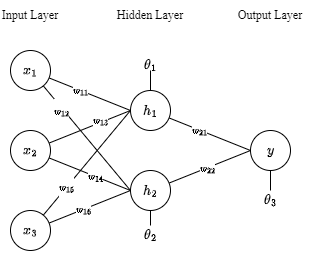
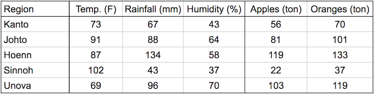
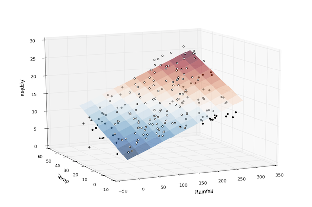

# Lesson 2: Understanding Deep Learnin

Having explored the historical background and inspiration behind deep learning, we can now delve into understanding the underlying mechanisms of this seemingly sci-fi technology. This journey will uncover how deep learning works, including the foundational concepts, methodologies, and real-world applications that make it a transformative force in modern technology.

### **Artificial Neural Network**
Artificial Neural Networks (ANNs) consist of artificial neurons, known as units, organized into layers that form the entire network. These layers can range from having a few dozen units to millions, depending on the complexity required to learn hidden patterns in the data. Typically, an ANN includes an input layer, one or more hidden layers, and an output layer. The input layer receives external data for analysis, which is then processed through the hidden layers that transform the input into valuable information for the output layer. The output layer then generates a response based on the processed data.



In most neural networks, units in different layers are interconnected, with each connection having a weight that determines the influence of one unit on another. As data flows through these connections, the neural network progressively learns from the data, ultimately producing an output from the output layer.

Artificial neural networks are trained using a dataset. To teach an ANN to recognize a cat, it is presented with thousands of different cat images. The network learns to identify cats by analyzing these images. Once trained, the ANN is tested by classifying new images and determining whether they are cat images or not. The output is compared to a human-provided label. If the ANN misclassifies an image, backpropagation is used to refine the network's weights based on the error rate. This process iterates until the ANN can accurately recognize cat images with minimal errors.

### **Feedforward Neural Network**

The feedforward neural network is one of the most basic artificial neural networks (ANNs). In this ANN, the data or input provided travels in a single direction. It enters the ANN through the input layer and exits through the output layer, while hidden layers may or may not exist. The feedforward neural network has a front-propagated wave only and usually does not involve backpropagation.

Assume neurons have a **sigmoid activation function**, actual output $y = 1$, and **learning rate** $\alpha = 0.9$.

---

To calculate $H_1$, we need to calculate first the weighted sum of the input values added by the bias $\theta$.

$$
\begin{aligned}
Z &= \sum_j (w_{i,j} \cdot x_i) + \theta_i \\
Z_1 &= (w_{11} \cdot x_1) + (w_{13} \cdot x_2) + (w_{15} \cdot x_3) + \theta_1 \\
Z_2 &= (w_{12} \cdot x_1) + (w_{14} \cdot x_2) + (w_{16} \cdot x_3) + \theta_2
\end{aligned}
$$

After computing the **weighted sum**, we introduce non-linearity to the output result by applying a nonlinear function. For this example, let's use **sigmoid function.**

$$
\begin{aligned}
\sigma(Z_i) &= \frac{1}{1 + e^{-Z_i}} \\
H_1 &= \sigma(Z_1) \\
H_2 &= \sigma(Z_2)
\end{aligned}
$$

Now that we have computed the hidden layer's value, we can now proceed to computing the weighted sum for the output layer using the same procedure as how we compute the $Z_n$ and $H_n$.

$$
\begin{aligned}
Z_3 &= (w_{21} \cdot H_1) + (w_{22} \cdot H_2) + \theta_3 \\
\hat{y} &= \sigma(Z_3)
\end{aligned}
$$

This is how the calculations in a feedforward neural network are traversed from input to output.

---

### Laboratory Task 2

Instruction: Perform a single forward pass and compute for the error.

Input vector:

$$
x = \begin{bmatrix} 1 \\ 0 \\ 1 \end{bmatrix}
$$

Target output:

$$
y = \begin{bmatrix} 1 \end{bmatrix}
$$

Activation function for this example (ReLU):

$$
f = \max(0, Z_n)
$$

Hidden layer weights:

$$
W_{\text{hidden}} =
\begin{bmatrix}
w_{11} = 0.2 & w_{12} = -0.3 \\
w_{13} = 0.4 & w_{14} = 0.1 \\
w_{15} = -0.5 & w_{16} = 0.2
\end{bmatrix}
$$

Output layer weights:

$$
W_{\text{output}} =
\begin{bmatrix}
w_{21} = -0.3 \\
w_{22} = -0.2
\end{bmatrix}
$$

Bias vector:

$$
\theta =
\begin{bmatrix}
\theta_1 = -0.4 \\
\theta_2 = 0.2 \\
\theta_3 = 0.1
\end{bmatrix}
$$

---

### **Backward Propagation of Errors**

Backward propagation a.k.a backprop or backward pass is a fundamental algorithm used for training artificial neural networks. It involves a two-step process: a forward pass and a backward pass. During the forward pass, input data is fed through the network, and the output is generated. The error, or the difference between the predicted output and the actual target, is then calculated. In the backward pass, this error is propagated back through the network, layer by layer, to update the weights and biases. This is done by computing the gradient of the loss function with respect to each weight using the chain rule of calculus. By iteratively adjusting the weights in the direction that reduces the error, backpropagation helps the network learn and improve its performance over time. This process continues until the network's predictions are sufficiently accurate or another stopping criterion is met.

The initial value for $\hat{y}$ is not the optimal value since the parameters used were just randomly selected. Therefore, after the forward propagation, a backward propagation algorithm is employed to update the parameters ($w$ and $\theta$).

The error at the output layer is calculated as the difference between the predicted output ($\hat{y}$) and the actual output ($y$):
$$\delta = \hat{y} - y$$
Compute Hidden Layer Error ($\delta_h$)
$$\delta_h = (\delta_o W^T_o) \cdot \sigma'(Z_h)$$
Where:

$\sigma'(Z_h)$ is the derivative of the sigmoid activation function applied to the hidden layer activations $Z_h$:
$\sigma'(Z_h) = A_h \cdot (1 - A_h)$
$W^T_o$ is the transpose of the output weights matrix $W_o$.

Calculate Gradients
Once we have the errors ($\delta_o$ and $\delta_h$), we compute the gradients of the error with respect to the weights ($W_o$ and $W_h$).
Gradients for Output Layer Weights ($\frac{\partial E}{\partial W_o}$)
$$\frac{\partial E}{\partial W_o} = A\frac{T}{h} \delta_o$$
Gradients for Hidden Layer Weights ($\frac{\partial E }{\partial W_h}$)
$$\frac{\partial E}{\partial W_h} = X^T \delta_h$$
Finally, the weights are updated using the gradients and the learning rate ($\alpha$).

---

### Laboratory Task 3

Instruction: Perform a forward and backward propagation in python using the inputs from Laboratory Task 2

```python 
x = np.array([1, 0, 1]) 
y = np.array([1]) # use relu as the activation function. 

# learning rate 
lr = 0.001 
```

---

### **Introduction to PyTorch**


PyTorch is a powerful and widely-used open-source framework for deep learning, developed by Facebook's AI Research lab. It is designed to provide flexibility and speed for both research and production environments. PyTorch's primary strength lies in its dynamic computation graph, which allows for real-time changes and debugging, making it easier to experiment with new ideas. This is in contrast to static computation graphs used by other frameworks like TensorFlow. PyTorch supports a range of applications, from natural language processing to computer vision, through its extensive library of pre-built modules and tools. Additionally, its integration with Python makes it accessible to a large community of developers and researchers, fostering rapid development and collaboration. With a strong emphasis on simplicity and performance, PyTorch has become a go-to tool for many in the deep learning community.

**Setting up the Virtual Enviroment**

A virtual environment is a self-contained directory that isolates a specific Python environment, allowing users to manage dependencies and packages for different projects independently. This ensures that each project can have its own unique set of libraries and versions without conflicts, avoiding issues that arise from global installations. Virtual environments are particularly useful for maintaining consistent development environments, making it easier to manage project-specific dependencies and ensuring that applications run smoothly across different setups. Tools like **venv** and **virtualenv** facilitate the creation and management of these environments. We can create a virtual environment using either **pip** or **conda**.

**With PIP**
*   Make sure that you have installed python and have its directory path added in the machine's environment variables.
*   Create a new folder, make sure that you know the directory of the new folder that you have created.
*   Open command prompt and change the directory to the new folder that you created.
*   Considering that you already have configured pip in the environment variables, you can now install libraries.
*   Run command
    pip install virtualenv

*   You can create a virtual enviroment with a specific python version but only if the specific version is installed in your system.

*   Run command
    virtualenv -p /path/to/pythonX.X /path/to/new/virtual/environment

*   Replace
    /path/to/pythonX.X
    with the path to the desired Python executable (e.g.,/usr/bin/python3.8) and
    /path/to/new/virtual/environment
    
    with the path where you want to create the virtual environment.

*   Activate the virtual environment, make sure that you are inside the directory where the environment's folder is also under.

*   Run command
    env\_name/Scripts/activate

*   Replace
    env\_name 
    with the name of the environment you created.

  
**With CONDA**

*   Make sure that [anaconda](https://www.anaconda.com/) is installed in you system.

*   Open anaconda prompt and run command
    conda create -n python=3.X
    
*   Activate the environment by running the command
    conda activate env\_name

*   Replace
    env\_name
    with the name of the environment you created.

**PyTorch Installation**

1.  Make sure that python is installed in your local device, the stable version of pytorch runs on python version 3.6 to 3.9. Make sure that your python version is in between this range. You can check the python version using command the command;

python --version

5.  Activate the virtual environment, for this demonstration, let's just use the conda virtual enviroment.

conda activate env\_name

9.  Go to [https://pytorch.org/get-started/locally/](https://pytorch.org/get-started/locally/) and select appropriate machine configurations and copy the generated command.  
    If you have a CUDA enabled GPU, you can download and install CUDA toolkit version 11.8 or 12.1 first. Otherwise you may only select CPU.
  
12.  Paste the command in the anaconda prompt where you activated the virtual enviroment and wait patiently.  
    Just click
    
    Y
    
    when prompted with a question to proceed installation.
  
### **PyTorch Components**

Let's have linear regression as a case study to study the different components of PyTorch. These are the following components we will be covering:

1.  Specifying input and target
2.  Dataset and DataLoader
3.  nn.Linear (Dense)
4.  Define loss function
5.  Define optimizer function
6.  Train the model

Consider this data:



In a linear regression model, each target variable is estimated to be a weighted sum of the input variables, offset by some constant, known as a bias :  

$$
\text{yield}_{\text{apple}} = w_{11} \cdot \text{temp} + w_{12} \cdot \text{rainfall} + w_{13} \cdot \text{humidity} + b_{1}
$$

$$
\text{yield}_{\text{orange}} = w_{21} \cdot \text{temp} + w_{22} \cdot \text{rainfall} + w_{23} \cdot \text{humidity} + b_{2}
$$

Visually, it means that the yield of apples is a linear or planar function of temperature, rainfall and humidity:



The learning part of linear regression is to figure out a set of weights **w11, w12,... w23, b1 & b2** using gradient descent.

**Sample Implementation**

---

```python
import torch 
import numpy as np 
import sys
```
```python 
torch.__version__
```
'2.4.1+cu118'

```python 
torch.cuda.is_available() 
```
True 

```python 
print(torch.version.cuda) 
```

```python
# We can check whether we have gpu
device = torch.device("cuda:0" if (torch.cuda.is_available()) else "cpu") print("Device: ", device) 
```
Device: cuda:0

---

**1. Specifiying input and target**

```python
# Input (temp, rainfall, humidity) 
x_train = np.array([ [73, 67, 43], [91, 88, 64], [87, 134, 58], [102, 43, 37], [69, 96, 70], [73, 67, 43], [91, 88, 64], [87, 134, 58], [102, 43, 37], [69, 96, 70], [73, 67, 43], [91, 88, 64], [87, 134, 58], [102, 43, 37], [69, 96, 70]], 
dtype='float32') 

# Targets (apples, oranges) 
y_train = np.array([ [56, 70], [81, 101], [119, 133], [22, 37], [103, 119], [56, 70], [81, 101], [119, 133], [22, 37], [103, 119], [56, 70], [81, 101], [119, 133], [22, 37], [103, 119]], dtype='float32') 
```

```python 
inputs = torch.from_numpy(x_train) 
targets = torch.from_numpy(y_train) 
print(inputs.size()) print(targets.size()) 
``` 
torch.Size([15, 3]) torch.Size([15, 2])

**2. Dataset and DataLoader**

PyTorch provides two data primitives: [**torch.utils.data.DataLoader**](https://pytorch.org/docs/stable/data.html#torch.utils.data.DataLoader) and [**torch.utils.data.Dataset**](https://pytorch.org/vision/0.18/datasets.html) that allow you to use pre-loaded datasets as well as your own data. Dataset stores the samples and their corresponding labels, and DataLoader wraps an iterable around the Dataset to enable easy access to the samples.

```python 
from torch.utils.data 
import TensorDataset
```
```python 
# Define dataset 
train_ds = TensorDataset(inputs, targets) train_ds[0:3]
```

We'll now create a **DataLoader**, which can split the data into batches of a predefined size while training. It also provides other utilities like shuffling and random sampling of the data.

```python 
from torch.utils.data 
import DataLoader 
``` 
```python 
# Define data loader 
batch_size = 3 
train_dl = DataLoader(train_ds, batch_size, shuffle=True) 
```
```python 
x, y = next(iter(train_dl)) 
```

The **DataLoader** is typically used in a for-in loop. Let's look at an example

```python 
for xb, yb in train_dl: 
    print(xb) print(yb) 
    break 
``` 
tensor([[ 73., 67., 43.], 
        [ 87., 134., 58.], 
        [ 69., 96., 70.]]) 
tensor([[ 56., 70.], 
        [119., 133.], 
        [103., 119.]])

In each iteration, the data loader returns one batch of data, with the given batch size. If shuffle is set to True, it shuffles the training data before creating batches. Shuffling helps randomize the input to the optimization algorithm, which can lead to faster reduction in the loss.

**3. Define some Layer** - **nn.Linear**

Instead of initializing the weights & biases manually, we can define the model using the **nn.Linear** class from PyTorch, which does it automatically.

```python 
import torch.nn as nn 
import random 
import os 

def seed_everything(seed=42): 
    random.seed(seed) 
    os.environ['PYTHONHASHSEED'] = str(seed) np.random.seed(seed) torch.manual_seed(seed) 
    torch.backends.cudnn.deterministic = True 
    torch.backends.cudnn.benchmark = False 
```

```python 
# Define model seed_everything() 
model = nn.Linear(3, 2) 

#nn.Linear assume this shape (in_features, out_features) 
print(model.weight) 
print(model.weight.size()) # (out_features, in_features) 
print(model.bias) 
print(model.bias.size())  #(out_features) 
``` 
Parameter containing: tensor([[ 0.4414, 0.4792, -0.1353], [ 0.5304, -0.1265, 0.1165]], requires_grad=True) torch.Size([2, 3]) Parameter containing: tensor([-0.2811, 0.3391], requires_grad=True) torch.Size([2])

In fact, our model is simply a function that performs a matrix multiplication of the **inputs** and the weights **w** and adds the bias **b** (for each observation)  

  

PyTorch models also have a helpful **.parameters** method, which returns a list containing all the weights and bias matrices present in the model. For our linear regression model, we have one weight matrix and one bias matrix.

```python 
# Parameters 
list(model.parameters()) #model.param returns a generator 
``` 
[Parameter containing: tensor([[ 0.4414, 0.4792, -0.1353], [ 0.5304, -0.1265, 0.1165]], requires_grad=True), Parameter containing: tensor([-0.2811, 0.3391], requires_grad=True)] 

```python 
#we can print the complexity by the number of parameters 
print(sum(p.numel() for p in model.parameters() if p.requires_grad)) 
``` 
8

We can use the **model(tensor)** API to perform a forward-pass that generate predictions.

```python 
# Generate predictions 
preds = model(inputs) preds 
``` 
tensor([[58.2323, 35.5896], [73.4005, 44.9262], [94.4899, 36.2867], [60.3437, 53.3070], [66.7117, 32.9453], [58.2323, 35.5896], [73.4005, 44.9262], [94.4899, 36.2867], [60.3437, 53.3070], [66.7117, 32.9453], [58.2323, 35.5896], [73.4005, 44.9262], [94.4899, 36.2867], [60.3437, 53.3070], [66.7117, 32.9453]], grad_fn=)

**4. Define Loss Function**

The nn module contains a lot of useful loss function like this: ```python 
criterion_mse = nn.MSELoss() 
criterion_softmax_cross_entropy_loss = nn.CrossEntropyLoss() 
``` 
```python 
mse = criterion_mse(preds, targets) 
print(mse) 
print(mse.item()) #print out the loss number 
``` 
tensor(2480.3708, grad_fn=) 2480.370849609375

**5. Define the Optimizer**
We use **optim.SGD** to perform stochastic gradient descent where samples are selected in batches (often with random shuffling) instead of as a single group. Note that **model.parameters()** is passed as an argument to **optim.SGD.**

```python
# Define optimizer #momentum update the weight based on past gradients also, which will be useful for getting out of local max/min #If our momentum parameter was $0.9$, we would get our current grad + the multiplication of the gradient #from one time step ago by $0.9$, the one from two time steps ago by $0.9^2 = 0.81$, etc. 

opt = torch.optim.SGD(model.parameters(), lr=0.0001, momentum=0.9) 
```
**6. Training - Putting Everything Together**

```python 
# Utility function to train the model 
def fit(num_epochs, model, loss_fn, opt, train_dl): # Repeat for given number of 
    epochs for epoch in range(num_epochs): # Train with batches of data 
    for xb,yb in train_dl: xb.to(device) #move them to gpu if possible, if not, it will be cpu yb.to(device) 

    # 1. Predict
    pred = model(xb) 
    
    # 2. Calculate loss 
    loss = loss_fn(pred, yb) 
    
    # 3. Calculate gradient 
    opt.zero_grad() #if not, the gradients will accumulate loss.backward() 

    #Print out the gradients. 
    print('dL/dw: ', model.weight.grad) 
    print('dL/db: ', model.bias.grad) 
    
    # 4. Update parameters using gradients opt.step() 
    Print the progress 
    if (epoch+1) % 10 == 0: sys.stdout.write("rEpoch [{}/{}], Loss: {:.4f}".format(epoch+1, num_epochs, loss.item())) 
``` 

```python 
#train for 100 epochs fit(100, model, criterion_mse, opt, train_dl) 
```
Epoch [100/100], Loss: 0.97430 

```python 
# Generate predictions 
preds = model(inputs) 
loss = criterion_mse(preds, targets) 
print(loss.item()) 
``` 
6.9544596672058105 

```python 
preds 
``` 
tensor([[ 54.2758, 71.3443], [ 79.3255, 101.8269], [113.9149, 134.4432], [ 17.1712, 38.2095], [100.2865, 120.0920], [ 54.2758, 71.3443], [ 79.3255, 101.8269], [113.9149, 134.4432], [ 17.1712, 38.2095], [100.2865, 120.0920], [ 54.2758, 71.3443], [ 79.3255, 101.8269], [113.9149, 134.4432], [ 17.1712, 38.2095], [100.2865, 120.0920]], grad_fn=) 

```python 
targets 
``` 
tensor([[ 56., 70.], [ 81., 101.], [119., 133.], [ 22., 37.], [103., 119.], [ 56., 70.], [ 81., 101.], [119., 133.], [ 22., 37.], [103., 119.], [ 56., 70.], [ 81., 101.], [119., 133.], [ 22., 37.], [103., 119.]])

### Labiratory Task 4

Instruction: Train a linear regression model in PyTorch using a regression dataset. Use the following parameters.

- Criterion: MSE Loss
- Fully Connected Layers x 2
- Batch Size: 8
- Optimizer: SGD
- Epoch: 1000