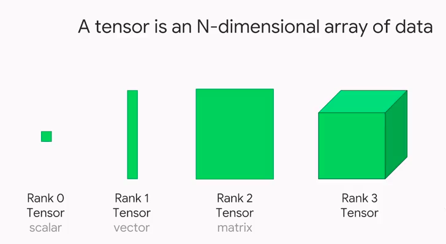

# PyTorch Tensor Objects Attributes and Methods

This will cover the following operations of a tensor object:

- Converting NumPy arrays to PyTorch tensors
- Creating tensors from scratch
- Indexing and slicing
- Reshaping tensors (tensor views)
- Tensor arithmetic and basic operations
- Dot products
- Matrix multiplication
- Additional, more advanced operations



In PyTorch, we use tensors to encode the inputs and outputs of a model, as well as the model’s parameters. Tensors are similar to NumPy’s ndarrays, **except that tensors can run on GPUs or other specialized hardware to accelerate computing.**


### **1. Converting NumPy arrays to PyTorch tensors**

A torch.Tensor is a multi-dimensional matrix containing elements of a single data type. Calculations between tensors can only happen if the tensors share the same dtype. In some cases tensors are used as a replacement for NumPy to use the power of GPUs (more on this later). Let's try to initialize a numpy array first!

```python 
import torch 
import numpy as np 
import sys 
``` 

```python 
arr = np.array([1,2,3,4,5]).astype('float64') 
print(arr) 
print(arr.dtype) 
print(type(arr)) 
``` 
[1. 2. 3. 4. 5.] float64 

```python 
x = torch.from_numpy(arr) # Equivalent to x = torch.as_tenso(arr) 
print(x) 
``` 
tensor([1., 2., 3., 4., 5.], dtype=torch.float64) 

```python 
# Print the datatype 
print(x.dtype) 
``` 
torch.float64 

```python 
# Print the tensor object type 
print(type(x))
print(x.type()) # this is more specific! 
``` 
torch.DoubleTensor 

```python 
arr2 = np.arange(0.,12.).reshape(4,3) 
print(arr2) 
print(type(arr2)) 
``` 
[[ 0. 1. 2.] [ 3. 4. 5.] [ 6. 7. 8.] [ 9. 10. 11.]] 

```python 
x2 = torch.from_numpy(arr2) 
print(x2) 
print(x2.type()) 
``` 
tensor([[ 0., 1., 2.], [ 3., 4., 5.], [ 6., 7., 8.], [ 9., 10., 11.]], dtype=torch.float64) torch.DoubleTensor 

```python 
rows, cols = 5, 5 # Create matrix using array comprehension 
mat = np.matrix([[np.round(np.random.random(), 3) 
for _ in range(cols)] 
for _ in range(rows)]) 
print(mat) 
print(type(mat)) 
xmat = torch.from_numpy(mat) 
print(xmat) 
print(type(xmat)) 
``` 
[[0.635 0.305 0.433 0.088 0.728] 
[0.261 0.629 0.377 0.029 0.192] 
[0.279 0.234 0.922 0.404 0.794] 
[0.645 0.888 0.575 0.37 0.645] 
[0.441 0.149 0.767 0.1 0.792]] 

tensor([[0.6350, 0.3050, 0.4330, 0.0880, 0.7280], 
        [0.2610, 0.6290, 0.3770, 0.0290, 0.1920], 
        [0.2790, 0.2340, 0.9220, 0.4040, 0.7940], 
        [0.6450, 0.8880, 0.5750, 0.3700, 0.6450], 
        [0.4410, 0.1490, 0.7670, 0.1000, 0.7920]], dtype=torch.float64) 
        
```python 
Check if an object is a tensor torch.is_tensor(mat) 
``` 
False

### **Tensor Datatypes**
| TYPE                     | NAME         | EQUIVALENT   | TENSOR TYPE   |
|--------------------------|-------------|-------------|---------------|
| 32-bit integer (signed)  | torch.int32 | torch.int   | IntTensor     |
| 64-bit integer (signed)  | torch.int64 | torch.long  | LongTensor    |
| 16-bit integer (signed)  | torch.int16 | torch.short | ShortTensor   |
| 32-bit floating point    | torch.float32 | torch.float | FloatTensor  |
| 64-bit floating point    | torch.float64 | torch.double | DoubleTensor |
| 16-bit floating point    | torch.float16 | torch.half  | HalfTensor    |
| 8-bit integer (signed)   | torch.int8   |             | CharTensor    |
| 8-bit integer (unsigned) | torch.uint8  |             | ByteTensor    |


```python 
xmat.type() 
``` 
'torch.DoubleTensor' 

```python 
z = torch.from_numpy(np.array(np.random.random()).astype('int64')) 
print(z) 
z.type() 
``` 

tensor(0) 'torch.LongTensor' [**torch.from_numpy()**](https://pytorch.org/docs/stable/torch.html#torch.from_numpy)  
[**torch.as_tensor()**](https://pytorch.org/docs/stable/torch.html#torch.as_tensor)  
[**torch.tensor()**](https://pytorch.org/docs/stable/torch.html#torch.tensor)  

There are a number of different functions available for [creating tensors](https://pytorch.org/docs/stable/torch.html#creation-ops). When using [**torch.from_numpy()**](https://pytorch.org/docs/stable/torch.html#torch.from_numpy) and [**torch.as_tensor()**](https://pytorch.org/docs/stable/torch.html#torch.as_tensor), the PyTorch tensor and the source NumPy array share the same memory. This means that changes to one affect the other. However, the [**torch.tensor()**](https://pytorch.org/docs/stable/torch.html#torch.tensor) function always makes a copy.

```python 
# Using torch.from_numpy() 
arr = np.arange(0,5) 
t = torch.from_numpy(arr) 
print(t) ```

tensor([0, 1, 2, 3, 4], dtype=torch.int32) 

```python 
arr[2] = 77 
print(t) 
``` 
tensor([ 0, 1, 77, 3, 4], dtype=torch.int32) 

```python 
# Using torch.tensor() 
arr = np.arange(0,5) 
t = torch.tensor(arr) 
print(t) 
``` 
tensor([0, 1, 2, 3, 4], dtype=torch.int32) 

```python 
arr[2] = 77 print(t) 
``` 
tensor([0, 1, 2, 3, 4], dtype=torch.int32)

### **2. Creating tensors from scratch**

**Uninitialized tensors with** .empty()  
[**torch.empty()**](https://pytorch.org/docs/stable/torch.html#torch.empty) returns an _uninitialized_ tensor. Essentially a block of memory is allocated according to the size of the tensor, and any values already sitting in the block are returned. This is similar to the behavior of numpy.empty().

```python 
x = torch.empty(4, 3) 
print(x) 
``` 
tensor([[0., 0., 0.], 
        [0., 0., 0.], 
        [0., 0., 0.], 
        [0., 0., 0.]])
    
**Initialized tensors with .zeros() and .ones()**

[**torch.zeros(size)**](https://pytorch.org/docs/stable/torch.html#torch.zeros)  
[**torch.ones(size)**](https://pytorch.org/docs/stable/torch.html#torch.ones)  

It's a good idea to pass in the intended dtype.

```python 
x = torch.zeros(4, 3, dtype=torch.int64) 
print(x) 
``` 
tensor([[0, 0, 0], 
        [0, 0, 0], 
        [0, 0, 0], 
        [0, 0, 0]]) 

```python 
x = torch.ones(4, 4) 
print(x)
 ```
tensor([[1., 1., 1., 1.], 
        [1., 1., 1., 1.], 
        [1., 1., 1., 1.], 
        [1., 1., 1., 1.]])

**Tensors from ranges**

[**torch.arange(start,end,step)**](https://pytorch.org/docs/stable/torch.html#torch.arange)  
[**torch.linspace(start,end,steps)**](https://pytorch.org/docs/stable/torch.html#torch.linspace)  

Note that with .arange(), end is exclusive, while with linspace(), end is inclusive.

```python 
x = torch.arange(0,18,2).reshape(3,3) 
print(x) 
``` 
tensor([[ 0, 2, 4], [ 6, 8, 10], [12, 14, 16]]) 

```python 
x = torch.linspace(0,18,12).reshape(3,4) 
print(x) 
``` 
tensor([[ 0.0000, 1.6364, 3.2727, 4.9091],
        [ 6.5455, 8.1818, 9.8182, 11.4545],
        [13.0909, 14.7273, 16.3636, 18.0000]])

**Tensors from data**

torch.tensor() will choose the dtype based on incoming data:

```python 
x = torch.tensor([1, 2, 3, 4]) 
print(x) 
print(x.dtype) 
print(x.type()) 

#changing datatypes 
x.type(torch.int32) 
``` 
tensor([1, 2, 3, 4]) torch.int64 torch.LongTensor tensor([1, 2, 3, 4], dtype=torch.int32)

You can also pass the dtype in as an argument. For a list of dtypes visit [https://pytorch.org/docs/stable/tensor _attributes.html#torch.torch.dtype](https://pytorch.org/docs/stable/tensor_attributes.html#torch.torch.dtype)

```python 
x = torch.tensor([8,9,-3], dtype=torch.int) 
print(x) 
print(x.dtype) 
print(x.type()) 
``` 
tensor([ 8, 9, -3], dtype=torch.int32) torch.int32 torch.IntTensor

**Changing the dtype of existing tensors**

Don't be tempted to use x = torch.tensor(x, dtype=torch.type) as it will raise an error about improper use of tensor cloning.  
Instead, use the tensor .type() method.

```python 
print('Old:', x.type()) 
x = x.type(torch.int64) 
print('New:', x.type())   
``` 
Old: torch.IntTensor 
New: torch.LongTensor

**Random number tensor**

[**torch.rand(size)**](https://pytorch.org/docs/stable/torch.html#torch.rand) returns random samples from a uniform distribution over [0, 1] 
[**torch.randn(size)**](https://pytorch.org/docs/stable/torch.html#torch.randn) returns samples from the "standard normal" distribution [σ = 1]  
    Unlike rand which is uniform, values closer to zero are more likely to appear.  
[**torch.randint(low,high,size)**](https://pytorch.org/docs/stable/torch.html#torch.randint) returns random integers from low (inclusive) to high (exclusive)

```python 
x = torch.rand(4, 3) 
print(x) 
``` 
tensor([[0.6671, 0.7989, 0.0904], [0.1503, 0.0468, 0.1173], [0.9687, 0.8473, 0.4124], [0.8930, 0.2437, 0.3226]]) 

```python 
x = torch.randn(4, 3) 
print(x) 
``` 
tensor([[ 0.5368, -0.0475, 0.7608], [-0.1866, 0.6753, -0.8869], [ 1.0618, -2.0881, 0.0266], [ 1.2814, -1.7819, -0.6486]]) 

```python 
x = torch.randint(0, 5, (4, 3)) 
print(x) 
``` 
tensor([[2, 3, 4], [0, 1, 0], [1, 2, 3], [4, 0, 0]])

**Random number tensors that follow the input size**

[**torch.rand_like(input)**](https://pytorch.org/docs/stable/torch.html#torch.rand_like)  
[**torch.randn_like(input)**](https://pytorch.org/docs/stable/torch.html#torch.randn_like)  
[**torch.randint_like(input,low,high)**](https://pytorch.org/docs/stable/torch.html#torch.randint_like)  
these return random number tensors with the same size as input

```python 
x = torch.zeros(2,5) 
print(x) 
``` 
tensor([[0., 0., 0., 0., 0.], [0., 0., 0., 0., 0.]]) 

```python 
x2 = torch.randn_like(x) print(x2) 
``` 
tensor([[-0.0275, -1.5322, -1.0815, 0.0945, 0.3136], 
[ 0.5034, -0.4533, -0.6120, 0.2258, -0.4032]])

The same syntax can be used with  
[**torch.zeros_like(input)**](https://pytorch.org/docs/stable/torch.html#torch.zeros_like)  
[**torch.ones_like(input)**](https://pytorch.org/docs/stable/torch.html#torch.ones_like)

```python 
x3 = torch.ones_like(x2) 
print(x3) 
``` 
tensor([[1., 1., 1., 1., 1.], 
[1., 1., 1., 1., 1.]]) 

```python 
x4 = torch.zeros_like(x3) 
print(x4) 
``` 
tensor([[0., 0., 0., 0., 0.], [0., 0., 0., 0., 0.]])

**Setting the random seed**
[**torch.manual_seed(int)**](https://pytorch.org/docs/stable/torch.html#torch.manual_seed) is used to obtain reproducible results

```python 
torch.manual_seed(42) 
x = torch.rand(2, 3) 
print(x) 
``` 
tensor([[0.8823, 0.9150, 0.3829], [0.9593, 0.3904, 0.6009]]) 

```python 
torch.manual_seed(42) 
x = torch.rand(2, 3) print(x) 
``` 
tensor([[0.8823, 0.9150, 0.3829], [0.9593, 0.3904, 0.6009]])

**Tensor attributes**

Besides dtype, we can look at other [tensor attributes](https://pytorch.org/docs/stable/tensor_attributes.html) like shape, device and layout.

```python 
x.shape 
``` 
torch.Size([2, 3]) 

```python 
x.size() # equivalent to x.shape 
``` 
torch.Size([2, 3])

 ```python 
 x.device 
 ``` 
 device(type='cpu')

PyTorch supports use of multiple [devices](https://pytorch.org/docs/stable/tensor_attributes.html#torch-device), harnessing the power of one or more GPUs in addition to the CPU. We won't explore that here, but you should know that operations between tensors can only happen for tensors installed on the same device.

```python 
x.layout 
``` 
torch.strided

PyTorch has a class to hold the [memory layout](https://pytorch.org/docs/stable/tensor_attributes.html#torch.torch.layout) option. The default setting of [strided](https://en.wikipedia.org/wiki/Stride_of_an_array) will suit our purposes throughout the course.

### **3. Indexing and Slicing**

Extracting specific values from a tensor works just the same as with NumPy arrays.

```python 
x = torch.arange(6).reshape(3,2) 
print(x) 
``` 
tensor([[0, 1], [2, 3], [4, 5]]) 

```python 
# Grabbing the right hand column values 
x[:,1]
``` 
tensor([1, 3, 5]) 

```python 
# Grabbing the right hand column as a (3,1) slice 
x[:,1:] 
``` 
tensor([[1], [3], [5]])

### **4. Reshape tensors with .view()**

[**view()**](https://pytorch.org/docs/master/tensors.html#torch.Tensor.view) and [**reshape()**](https://pytorch.org/docs/master/torch.html#torch.reshape) do essentially the same thing by returning a reshaped tensor without changing the original tensor in place.  
There's a good discussion of the differences [here](https://stackoverflow.com/questions/49643225/whats-the-difference-between-reshape-and-view-in-pytorch).

```python 
x = torch.arange(10) 
print(x) 
``` 
tensor([0, 1, 2, 3, 4, 5, 6, 7, 8, 9]) 

```python 
y = x.view(2,5) y[0, 0] = 5 y 
``` 
tensor([[5, 1, 2, 3, 4], [5, 6, 7, 8, 9]]) 

```python 
# x is changed by changing y, which shares the data... x 
``` 
tensor([5, 1, 2, 3, 4, 5, 6, 7, 8, 9]) 

```python 
a = x.reshape(5,2) a[0, 0] = 99 
```
```python 
x 
``` 
tensor([99, 1, 2, 3, 4, 5, 6, 7, 8, 9])


**Adopt another tensors shape with.view_as()**

[**view_as(input)**](https://pytorch.org/docs/master/tensors.html#torch.Tensor.view_as) only works with tensors that have the same number of elements.

```python 
z = torch.ones((5, 2)) x.view_as(z) 
``` 
tensor([[99, 1], [ 2, 3], [ 4, 5], [ 6, 7], [ 8, 9]]) 
```python 
z 
``` 
tensor([[1., 1.], [1., 1.], [1., 1.], [1., 1.], [1., 1.]])

### **5. Tensor Arithmetic**

Adding tensors can be performed a few different ways depending on the desired result.  
As a simple expression:

```python 
a = torch.tensor([1,2,3], dtype=torch.float) 
b = torch.tensor([4,5,6], dtype=torch.float) 
print(a + b) 
``` 
tensor([5., 7., 9.])

As arguments passed into a torch operation:

```python 
print(torch.add(a, b)) 
``` 
tensor([5., 7., 9.])

With an output tensor passed in as an argument:

```python 
result = torch.empty(3) 
torch.add(a, b, out=result) 

# equivalent to 
result=torch.add(a,b) 
print(result) 
``` 
tensor([5., 7., 9.]) 

```python 
a.add_(b) 

# equivalent to 
a=torch.add(a,b) 
print(a)
 ``` 
tensor([5., 7., 9.])

**NOTE:** Any operation that changes a tensor in-place is post-fixed with an underscore _.  
In the above example: a.add_(b) changed a.

### Basic Tensor Operations

#### Arithmetic Operations

| Operation | Function   | Description                  |
|-----------|-----------|------------------------------|
| a + b     | a.add(b)  | element-wise addition        |
| a - b     | a.sub(b)  | subtraction                  |
| a * b     | a.mul(b)  | multiplication               |
| a / b     | a.div(b)  | division                     |
| a % b     | a.fmod(b) | modulo (remainder after division) |
| a^b       | a.pow(b)  | power                        |

#### Monomial Operations

| Operation          | Function              | Description                  |
|-------------------|---------------------|------------------------------|
| |a|               | torch.abs(a)        | absolute value               |
| 1/a               | torch.reciprocal(a) | reciprocal                   |
| √a                | torch.sqrt(a)       | square root                  |
| log(a)            | torch.log(a)        | natural log                  |
| e^a               | torch.exp(a)        | exponential                  |
| 12.34 ⇒ 12        | torch.trunc(a)      | truncated integer            |
| 12.34 ⇒ 0.34      | torch.frac(a)       | fractional component         |

#### Summary Statistics

| Operation       | Function        | Description                                                                 |
|-----------------|----------------|-----------------------------------------------------------------------------|
| ∑a              | torch.sum(a)   | sum                                                                         |
| ȧ (mean)        | torch.mean(a)  | mean                                                                        |
| amax             | torch.max(a)   | maximum                                                                     |
| amin             | torch.min(a)   | minimum                                                                     |
| torch.max(a,b)  | torch.max(a,b) | returns a tensor of size a containing the element-wise max between a and b  |

**NOTE:** Most arithmetic operations require float values. Those that do work with integers return integer tensors.  
For example, torch.div(a,b) performs floor division (truncates the decimal) for integer types, and classic division for floats.

### **6. Dot Products**

A [dot product](https://en.wikipedia.org/wiki/Dot_product) is the sum of the products of the corresponding entries of two 1D tensors. If the tensors are both vectors, the dot product is given as:  

$$
\begin{bmatrix} a & b & c \end{bmatrix} \cdot \begin{bmatrix} d & e & f \end{bmatrix} = ad + be + cf
$$

If the tensors include a column vector, then the dot product is the sum of the result of the multiplied matrices. For example:

$$
\begin{bmatrix} a & b & c \end{bmatrix} \cdot \begin{bmatrix} d \\ e \\ f \end{bmatrix} = ad + be + cf
$$
  
Dot products can be expressed as [**torch.dot(a,b)**](https://pytorch.org/docs/stable/torch.html#torch.dot) or a.dot(b) or b.dot(a)

```python 
a = torch.tensor([1,2,3], dtype=torch.float) 
b = torch.tensor([4,5,6], dtype=torch.float) 
print(a.dot(b)) 
``` 
tensor(32.)

**NOTE:** There's a slight difference between torch.dot() and numpy.dot(). While torch.dot() only accepts 1D arguments and returns a dot product, numpy.dot() also accepts 2D arguments and performs matrix multiplication. We show matrix multiplication below.

### **7. Matrix Multiplication**

2D [Matrix multiplication](https://en.wikipedia.org/wiki/Matrix_multiplication) is possible when the number of columns in tensor **A** matches the number of rows in tensor **B**. In this case, the product of tensor **A** with size $(x,y)$ and tensor **B** with size $(y,z)$ results in a tensor of size $(x,z)$  
$begin{bmatrix} a & b & c  d & e & f end{bmatrix} ;times; begin{bmatrix} m & n  p & q  r & s end{bmatrix} = begin{bmatrix} (am+bp+cr) & (an+bq+cs)  (dm+ep+fr) & (dn+eq+fs) end{bmatrix}$  
Matrix multiplication can be computed using [**torch.mm(a,b)**](https://pytorch.org/docs/stable/torch.html#torch.mm) or a.mm(b) or a @ b

```python 
a = torch.tensor([[0,2,4],[1,3,5]], dtype=torch.float) 
b = torch.tensor([[6,7],[8,9],[10,11]], dtype=torch.float) 
print('a: ',a.size()) 
print('b: ',b.size()) 
print('a x b: ',torch.mm(a,b).size()) 
``` 
a: torch.Size([2, 3]) 
b: torch.Size([3, 2]) 
a x b: torch.Size([2, 2]) 

```python 
print(torch.mm(a,b)) 
``` 
tensor([[56., 62.], [80., 89.]]) 

```python 
print(a.mm(b)) 
``` 
tensor([[56., 62.], [80., 89.]]) 

```python 
print(a @ b) 
``` 
tensor([[56., 62.], [80., 89.]])

### Matrix multiplication with broadcasting

Matrix multiplication that involves [broadcasting](https://pytorch.org/docs/stable/notes/broadcasting.html#broadcasting-semantics) can be computed using [**torch.matmul(a,b)**](https://pytorch.org/docs/stable/torch.html#torch.matmul) or `a.matmul(b)` or `a @ b`

```python 
t1 = torch.randn(2, 3, 4) 
t2 = torch.randn(4, 5) 
print(torch.matmul(t1, t2).size()) 
``` 
torch.Size([2, 3, 5])

However, the same operation raises a **RuntimeError** with torch.mm():

```python 
print(torch.mm(t1, t2).size()) 
t1 = torch.randn(2, 3) 
t1 
``` 
tensor([[ 0.7596, 0.7343, -0.6708], [ 2.7421, 0.5568, -0.8123]]) 

```python 
t2 = torch.randn(3).reshape(3,1) 
t2 
``` 
tensor([[ 1.1964], [ 0.8613], [-1.3682]]) 

```python 
print(torch.mm(t1, t2))
``` 
tensor([[2.4590], [4.8718]])

### **8. Additional Operations**

**L2 or Euclidean Norm**

  See [**torch.norm()**](https://pytorch.org/docs/stable/torch.html#torch.norm)  
  The [Euclidian Norm](https://en.wikipedia.org/wiki/Norm_(mathematics)#Euclidean_norm) gives the vector norm of $x$ where $x=(x_1,x_2,...,x_n)$.  

  It is calculated as  
  
  ${displaystyle left|{boldsymbol {x}}right|_{2}:={sqrt {x_{1}^{2}+cdots +x_{n}^{2}}}}$  
  
  When applied to a matrix, torch.norm() returns the [Frobenius norm](https://en.wikipedia.org/wiki/Matrix_norm#Frobenius_norm) by default.

```python 
x = torch.tensor([2.,5.,8.,14.]) 
x.norm() 
``` 
tensor(17.)

**Number of Elements**

  See [**torch.numel()**](https://pytorch.org/docs/stable/torch.html#torch.numel)  
  Returns the number of elements in a tensor.

```python 
x = torch.ones(3,7) 
x.numel() 
``` 
21


### Laboratory Task 5

1. Perform Standard Imports
2. Create a function called `set_seed()` that accepts `seed: int` as a parameter, this function must return nothing but just set the seed to a certain value 
3. Create a NumPy array called "arr" that contains 6 random integers between 0 (inclusive) and 5 (exclusive), call the `set_seed()` function and use `42` as the seed parameter.
4. Create a tensor "x" from the array above
5. Change the dtype of x from `int32` to `int64`
6. Reshape `x` into a 3x2 tensor  
There are several ways to do this. 
7. Return the right-hand column of tensor `x 
8. Without changing x, return a tensor of square values of `x  
There are several ways to do this. 
9. Create a tensor `y` with the same number of elements as `x`, that can be matrix-multiplied with `x  
Use PyTorch directly (not NumPy) to create a tensor of random integers between 0 (inclusive) and 5 (exclusive). Use 42 as seed.  
Think about what shape it should have to permit matrix multiplication. 
10. Find the matrix product of `x` and `y