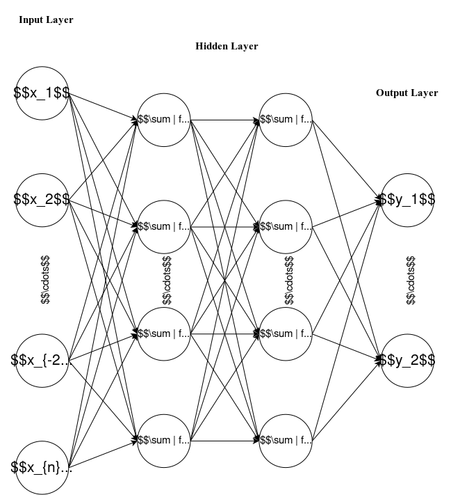
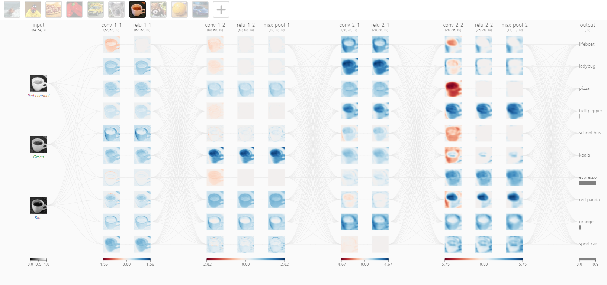

# Main Types of Deep Learning Neural Networks

Deep learning neural networks come in various architectures, each suited to different types of tasks and data. The most basic form is the Feedforward Neural Network (FNN), also known simply as a multi-layer perceptron (MLP). In these networks, data moves in one direction—from input nodes, through hidden layers, to output nodes. Each layer consists of neurons, which are mathematical functions that compute a weighted sum of inputs and pass it through an activation function. These networks are primarily used for tasks where data has a fixed-size input, like image classification or simple regression problems. They are the foundation of more complex neural network types.

### **Feedforward Neural Network**

Convolutional Neural Networks (CNNs) are specialized for processing grid-like data, such as images. They use convolutional layers to automatically and adaptively learn spatial hierarchies of features from input images. Convolutional layers apply filters (kernels) across the input data to produce feature maps, capturing patterns like edges, textures, and shapes. This is followed by pooling layers, which reduce the spatial dimensions of the feature maps and help in achieving spatial invariance. CNNs are highly effective for image-related tasks, including object detection, image segmentation, and facial recognition, due to their ability to detect local patterns and hierarchical structures.

### **Convolutional Neural Network**

[

https://poloclub.github.io/cnn-explainer/

](https://poloclub.github.io/cnn-explainer/)

Recurrent Neural Networks (RNNs), including their variants like Long Short-Term Memory (LSTM) and Gated Recurrent Unit (GRU) networks, are designed to handle sequential data. Unlike feedforward networks, RNNs have connections that form directed cycles, enabling them to maintain a memory of previous inputs. This makes them ideal for tasks where context and order are crucial, such as natural language processing, time series prediction, and speech recognition. LSTMs and GRUs address the problem of vanishing gradients in traditional RNNs by incorporating mechanisms to retain long-term dependencies and improve learning from long sequences. These networks have been pivotal in advancements in machine translation, text generation, and other sequence-based applications.

### **Recurrent Neural Network**

In this course, we will focus on these three fundamental types of deep neural networks. These architectures are the most common and serve as the foundation for understanding more advanced deep learning models. Feedforward Neural Networks are essential for grasping the basics of neural network operation and supervised learning. Convolutional Neural Networks are pivotal for image processing tasks, leveraging their ability to detect spatial hierarchies in data. Recurrent Neural Networks, along with their variants like LSTMs and GRUs, are crucial for sequence data analysis, such as language processing and time series prediction. Mastering these networks will equip you with the necessary skills to explore and understand more complex and specialized neural network architectures. Later in the course, we will delve deeper into these foundational networks to uncover more advanced techniques and applications, preparing you for a comprehensive understanding of the deep learning field.