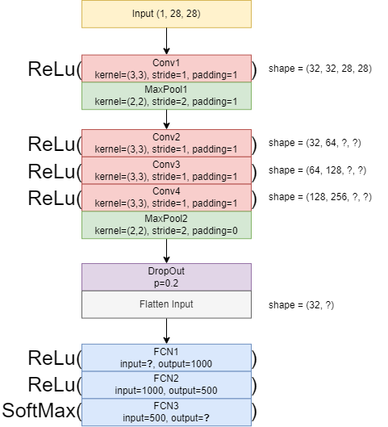

# CNN Implementation 

## Training CNN Model using MNIST Dataset For this demonstration we will be using the MNIST dataset, which is a popular dataset for training deep learning models. 

---

#### **Import Standard Libraries**

```python 
import torch 
import torch.nn as nn 
import torch.nn.functional as F from torch.utils.data 
import DataLoader 
import torchvision from torchvision 
import datasets, transforms 
import random 
import numpy as np from sklearn.metrics 
import confusion_matrix, classification_report, accuracy_score import matplotlib.pyplot as plt %matplotlib inline torch.backends.cudnn.deterministic=True torch.set_printoptions(sci_mode=False) 
import time 
from tqdm.notebook 
import tqdm 
``` 

**torchvision.datasets** module provides a variety of datasets that are commonly used for training machine learning and deep learning models. These datasets are preprocessed and can be easily integrated into PyTorch workflows for tasks such as image classification, object detection, and more. Example datasets include: - MNIST - CIFAR10 - CIFAR100 - ImageNet 

--- 

```python 
# `transforms` is used to apply augmentation techniques and modification to the image data (e.g, rotate, resize, normalization, etc.).
# for this one, let's just convert the image arrays to tensor. 
transform = transforms.ToTensor() 
train_data = datasets.MNIST(root='data', train=True, download=True, transform=transform) 
test_data = datasets.MNIST(root='data', train=False, download=True, transform=transform) 
``` 
```python
# the training data have 60,000 images, let's take a small portion from it for the validation. 
# what's the importance of validation data? 
train_data 
``` 
```python 
# unseen images 
test_data 
```
```python 
# 50,000 for training and 10,000 for validation 
train_set, val_set = torch.utils.data.random_split(train_data, [0.8, 0.2]) 
```

```python 
# function to set the seed 
def set_seed(seed): 
    np.random.seed(seed) 
    torch.manual_seed(seed) 
    random.seed(seed) 
``` 
PyTorch provides two data primitives: `torch.utils.data.DataLoader` and `torch.utils.data.Dataset` that allow you to use pre-loaded datasets as well as your own data. Dataset stores the samples and their corresponding labels, and DataLoader wraps an iterable around the Dataset to enable easy access to the samples. 

--- 

```python 
set_seed(143) 
batch_size = 10 
train_loader = DataLoader(train_set, batch_size=batch_size, shuffle=True) 
val_loader = DataLoader(val_set, batch_size=batch_size, shuffle=True) 
test_loader = DataLoader(test_data, batch_size=batch_size, shuffle=False)
```
```python 
set_seed(143) 
images, labels = iter(train_loader).__next__() 
def display_image(batch): 
    batch = batch.detach().numpy() 
    fig, axs = plt.subplots(1, len(batch), figsize=(12, 2)) 
    for i in range(len(batch)): 
        axs[i].imshow(batch[i, 0, :, :], vmin=0, vmax=1) axs[i].axis('off') axs[i].set_title(labels[i].numpy()) 
        plt.show() 
``` 

For this demonstration, we will use the following architecture: it consists of two convolutional layers, each followed by its own max-pooling layer and activation function. Additionally, there are two fully connected layers, with the second layer using the softmax activation function. 

---

### **Input Images**

```python 
display_image(images) 
print(images.shape) # (b, c, h, w) 
``` 
```python 
def calc_out(w, f, s, p): 
    """ Calculate output shape of a matrix after a convolution. The results are only applicable for square matrix kernels and images only. """ 
    print(f'Output Shape: {(w - f + 2 * p) // s + 1}') 
```

### **First Convolution Layer + Activation Function**

```python 
# The first convolution must output a 28 by 28 image size
calc_out(28, 3, 1, 1) 
``` 
```python 
conv1 = nn.Conv2d(1, 32, (3,3), 1, 1) 
x = F.relu(conv1(images)) 
display_image(x) print(x.shape) 
```

### **First Pooling (MaxPooling)**

```python 
# first maxpooling must output a 14 by 14 size 
calc_out(28, 2, 2, 0) 
``` 
```python 
pool1 = nn.MaxPool2d((2,2), 2) 
x = pool1(x) 
display_image(x) 
print(x.shape) 
```

### **Let's examine the feature map.**

```python 
idx = 3 feature_maps = x[idx].view((1, 32, 14, 14)).detach().numpy() 
fig, axs = plt.subplots(1, 32, figsize=(12, 2)) 
for i in range(32): 
    axs[i].imshow(feature_maps[0, i, :, :], vmin=0, vmax=1) axs[i].axis('off') 
```

### **Second Convolution**

```python 
calc_out(14, 3, 1, 1) 
``` 
```python 
conv2 = nn.Conv2d(32, 64, (3,3), 1, 1) x = F.relu(conv2(x)) display_image(x) 
print(x.shape) 
```

### **Second Pooling (MaxPooling)**

```python 
calc_out(14, 2, 2, 0) 
``` 
```python 
pool2 = nn.MaxPool2d((2,2), 2) 
x = pool2(x) 
display_image(x) 
print(x.shape) ```
```python 
idx = 3 feature_maps = x[idx].view((1, 64, 7, 7)).detach().numpy() 
fig, axs = plt.subplots(1, 64, figsize=(12, 2)) 

for i in range(64): 
    axs[i].imshow(feature_maps[0, i, :, :], vmin=0, vmax=1) axs[i].axis('off') 
```

### **Flatten**

```python 
flat = x.view((-1, 64*7*7)) 
fcn1 = nn.Linear(64*7*7, 128)
fcn2 = nn.Linear(128, 10) 
out = fcn1(flat) 
out = F.softmax(fcn2(out), dim=1) 
```
```python 
# prediction 
# assess the prediction 
[i.argmax().item() for i in out] 
``` 

```python 
# true label 
[i.item() for i in labels] 
```

**QUESTION:**  
Why is it that the true and the predicted value is very distant from each other?

### **Now let's put them all together**

```python 
class CNN(nn.Module): 
    def __init__(self): 
        super().__init__() # just the initialization 
        self.conv1 = nn.Conv2d(1, 32, (3,3), 1, 1) 
        self.pool1 = nn.MaxPool2d((2,2), 2) 
        self.conv2 = nn.Conv2d(32, 64, (3,3), 1, 1) 
        self.pool2 = nn.MaxPool2d((2,2), 2) 
        self.fcn1 = nn.Linear(64*7*7, 128) 
        self.fcn2 = nn.Linear(128, 10) 
    def forward(self, x): # seuential 
        x = F.relu(self.conv1(x)) 
        x = self.pool1(x) 
        x = F.relu(self.conv2(x)) 
        x = self.pool2(x) 
        x = x.view(-1, 64*7*7) 
        x = self.fcn1(x) 
        x = F.softmax(self.fcn2(x), dim=1) return x 
```

### **Instantiate the Class**

```python 
model = CNN() 
model 
```

Model Parameters:

$quadbegin{align}(1times32times3times3)+32+(32times64times3times3)+64+(3136times128)+128+(128times10)+10 &= 288+32+18432+64+401408+128+1280+10 &= 421,642end{align}$  

```python 
def count_parameters(model):
    params = [p.numel() 
    for p in model.parameters() 
    if p.requires_grad] 
    for item in params: 
        print(f'{item:>6}') 
        print(f'______n{sum(params):>6}') 
        count_parameters(model) 
```

### **Define Criterion and Optimizer**

```python 
criterion = nn.CrossEntropyLoss() 
optimizer = torch.optim.Adam(model.parameters(), lr=0.001)
```
```python 
# if your device has cuda enabled gpu, you can use it to accelerate the training process. 
device = torch.device('cuda' if torch.cuda.is_available() else 'cpu') 
print(device) 
model = model.to(device) 
```

### **Let's walk through the training loop**

```python 
for e in range(epochs): 
    train_corr = 0 
    val_corr = 0 
``` 
This will iterate `5` times as what is defined below. `train_corr` and `val_corr` serves as temporary place holders for correctly predicted train data and correctly predicted validation data. Hence, `train_corr` and `val_corr` will be re-initialized to `0` again if an entire epoch is done.  

```python 
for train_b, (x_train, y_train) in tqdm(enumerate(train_loader)): 
    train_b += 1 x_train = x_train.to(device) 
    y_train = y_train.to(device) 
``` 
The second loop (nested loop) iterates over the `train_loader`. A single iteration of the `train_loader` is equal to `1` batch of features and targets, our batch size is 10, therefore in every iteration of the `train_loader` we are processing `10` instances. The entire training set or the `len(train_loader.dataset)` is `50,000`. Therefore, to finish an entire epoch, we need to process `5000` batches with a batch size of `10` (5000 x 10 = 50,000). 

**NOTE:** When an iterable object is wrapped around an `enumerate` function, the output will return an index for each iterated values. `train_b` is the number of batches that has been processed. The `to()` functions next to the `x_train` and `y_train` are simply there to move the data into the available computing device. Remember that you need to move the `model` as well to the available device.  

**OUTPUT:** `x_train.shape` = `torch.Size([10, 1, 28, 28])` `y_train.shape` = `torch.Size([10])` 

```python 
train_pred = model(x_train) 
train_loss = criterion(train_pred, y_train) 
train_pred_vec = torch.max(train_pred.data, 1)[1] 
train_corr += (train_pred_vec == y_train).sum() 
``` 
`train_pred` represents the model's predictions for the current batch. The shape of train_pred is `torch.Size([10, 10])`. Each row in `train_pred` corresponds to an instance in the batch, and each column represents a class. The values in each row indicate the model's estimated probabilities or scores for each class for that instance.  

`train_loss` is a scalar value of the error that was calculated from that particular batch.  

`train_pred_vec` is a vector that contained the predicted labels of the current batch. The values are integer that ranges from 0 to 9. `train_pred_vec.shape` is `torch.Size([10])`, the values represents each predicted label of each instance.  

`train_corr` performs comparison operation to check how many samples in the batch was correctly predicted, the value of the `train_corr` will be inceremented, but will be re-initialized back to 0 when an entire epoch is done.  

```python 
# Update parameters 
optimizer.zero_grad() 
train_loss.backward() 
optimizer.step() 
``` 

We need to update the parameters for every batch that passes in every epoch, we can do this by applying `zero_grad()` to the optimizer, this will clear the gradients for the next batch, if we don't do that, the gradients will accumulate for every batch for the entire epoch.  

`train_loss.backward()` is used to compute the gradients of the loss with respect to the model's parameters during the backward pass of the training process. It's a fundamental step in the training loop of a neural network.  

`optimizer.step()` is a method used to update the parameters (weights and biases) of a neural network model during the training process. It is called after the gradients of the model's parameters have been computed during the backward pass. 

```python 
if train_b % 1250 == 0: 
    print(f"epoch: {e+1:2} | batch: {train_b:4} | instances: [{train_b*batch_size:6} / {len(train_loader) * batch_size}] | loss: {train_loss.item()}") 
    
    print(f"✅{train_corr.item()} of {train_b*batch_size:2} | accuracy: {round(((train_corr.item() / (train_b*batch_size))) * 100 , 3)}%")
``` 
This prints training progress information during each batch iteration in a concise format. It displays the current epoch, batch number, the number of processed instances, the loss, and the accuracy achieved up to that point in training. 

```python 
train_correct.append(train_corr.item()) 
train_losses.append(train_loss.item()) 
``` 

Appends current the batch's `train_corr` and `train_loss` on the empty lists outside the epoch. 

```python 
with torch.no_grad(): for val_b, (x_val, y_val) in enumerate(val_loader): 
    val_b += 1 x_val = x_val.to(device) 
    y_val = y_val.to(device) 
    val_pred = model(x_val) 
    val_pred_vec = torch.max(val_pred.data, 1)[1] 
    val_corr += (val_pred_vec == y_val).sum() 
    val_loss = criterion(val_pred, y_val) 
    val_correct.append(val_corr.item()) 
    val_losses.append(val_loss.item()) 
    val_acc = val_corr.item() / (len(val_loader) * batch_size) 
    
    if val_acc > best_acc:
    best_acc = val_acc torch.save(model.state_dict(), f"model/best_{model._get_name()}.pth") 
    
    print(f"t📁New best model saved! | accuracy: {best_acc*100}%") 
    train_epoch_acc = train_corr.item() / (batch_size * len(train_loader)) 
    val_epoch_acc = val_corr.item() / (batch_size * len(val_loader)) 
    train_accs.append(train_epoch_acc) 
    val_accs.append(val_epoch_acc) 
    print(f'nDuration: {time.time() - start_time:.0f} seconds') 
``` 

This part of the code performs the evaluation of the trained model for every epoch, the code is quite similar to the training process but without the updating of parameters. The code also have features of saving the `state_dict` (trained parameters) of the model with best accuracy.

```python 
set_seed(42) 
epochs = 5 
start_time = time.time() 
best_acc = 0.0 
train_correct = [] 
train_losses = [] 
train_accs = [] 
val_correct = [] 
val_losses = [] 

val_accs = [] for e in range(epochs): 
train_corr = 0 
val_corr = 0 

for train_b, (x_train, y_train) in tqdm(enumerate(train_loader)): 
    train_b += 1 x_train = x_train.to(device) 
    y_train = y_train.to(device) 
    train_pred = model(x_train) 
    train_loss = criterion(train_pred, y_train) 
    train_pred_vec = torch.max(train_pred.data, 1)[1] 
    
    # prediction vector 
    train_corr += (train_pred_vec == y_train).sum() 
    
    # Update parameters 
    optimizer.zero_grad() 
    train_loss.backward() 
    optimizer.step() if train_b % 1250 == 0: 

    print(f"epoch: {e+1:2} | batch: {train_b:4} | instances: 
    [{train_b*batch_size:6} / {len(train_loader) * batch_size}] | loss: {train_loss.item()}")
    
    print(f"✅{train_corr.item()} of {train_b*batch_size:2} | accuracy: 
    {round(((train_corr.item() / (train_b*batch_size))) * 100 , 3)}%") 
    
    train_correct.append(train_corr.item()) 
    train_losses.append(train_loss.item()) with torch.no_grad(): 
    for val_b, (x_val, y_val) in enumerate(val_loader): 
        val_b += 1 x_val = x_val.to(device) 
        y_val = y_val.to(device) 
        val_pred = model(x_val) 
        val_pred_vec = torch.max(val_pred.data, 1)[1] val_corr += (val_pred_vec == y_val).sum() 
        val_loss = criterion(val_pred, y_val) 
        val_correct.append(val_corr.item()) 
        val_losses.append(val_loss.item()) 
        val_acc = val_corr.item() / (len(val_loader) * batch_size) if val_acc > best_acc: best_acc = val_acc 
        torch.save(model.state_dict(), f"model/best_{model._get_name()}.pth") 
        
        print(f"t📁New best model saved! | accuracy: {best_acc*100}%") train_epoch_acc = train_corr.item() / (batch_size * len(train_loader)) val_epoch_acc = val_corr.item() / (batch_size * len(val_loader)) 
        
        train_accs.append(train_epoch_acc) 
        val_accs.append(val_epoch_acc) 
        print(f'nDuration: {time.time() - start_time:.0f} seconds') 
``` 

```python 
plt.figure(figsize=(5,2)) 
plt.plot(train_accs, label="Train") 
plt.plot(val_accs, label="Validation")
plt.xticks(ticks=range(0,5), labels=list(range(1,6))) 
plt.xlabel("Epoch") 
plt.ylabel("Accuracy") 
plt.title("Accuracy per Epoch") 
plt.legend() plt.show() 
``` 
```python 
plt.figure(figsize=(5,2)) 
plt.plot([train_losses[i-1] 

for i in range(5000, len(train_losses)+1, 5000)], label="Train") 
plt.plot([val_losses[i-1] 

for i in range(1000, len(val_losses)+1, 1000)], label="Validation") 
plt.xticks(ticks=range(0,5), labels=list(range(1,6))) 
plt.xlabel("Epoch") 
plt.ylabel("Loss") 
plt.title("Loss per Epoch") 
plt.legend() 
plt.show() 
```

### **Testing**

```python 
true_labels = [] 
pred_labels = [] 
with torch.no_grad(): 
    for b, (x_test, y_test) in enumerate(test_loader):
        x_test = x_test.to(device) 
        y_test = y_test.to(device) 
        test_pred = model(x_test) 
        test_pred_vec = torch.max(test_pred.data, 1)[1] true_labels.append(y_test) 
        pred_labels.append(test_pred_vec) 
``` 
```python 
true_labels = torch.cat(true_labels, dim=0) 
pred_labels = torch.cat(pred_labels, dim=0) 
```

### **Classification Matrix**

```python 
[v for k,v in train_data.class_to_idx.items()] 
```
```python 
true_labels 
``` 
```python 
pred_labels 
```
```python 
np.set_printoptions(formatter=dict(int=lambda x: f'{x:3}')) 
print(np.array([v for k,v in train_data.class_to_idx.items()]), 'n') 
print(confusion_matrix(true_labels.to('cpu'), pred_labels.to('cpu'))) 
```

### **Let's assess the misses**

```python 
true_labels 
``` 
```python 
misses = np.array([]) 
missed_label = np.array([]) 

for i in range(len(pred_labels.to('cpu'))): 
    if pred_labels[i] != true_labels.to('cpu')[i]: 
        misses = np.append(misses,i).astype('int64') 
        missed_label = np.append(missed_label, true_labels.to('cpu')[i]).astype('int64') 
        len(misses) 
``` 
```python 
wrong = [pred_labels[i].item() 

for i in misses[:10]] 
missed_images = [test_loader.dataset[j][0] 

for j in [i for i in misses[:10]]] 
fig, axs = plt.subplots(1, len(missed_images), figsize=(12, 2)) c = 0 

for i in missed_images: 
    axs[c].imshow(i.view(28, 28), vmin=0, vmax=1) 
    axs[c].axis('off') axs[c].set_title(f"{missed_label[c]} as {wrong[c]}") c += 1 
    plt.show() 
```

### **Laboratory Activty**

**Instruction:** Convert the following CNN architecture diagram into a PyTorch CNN Architecture.

 